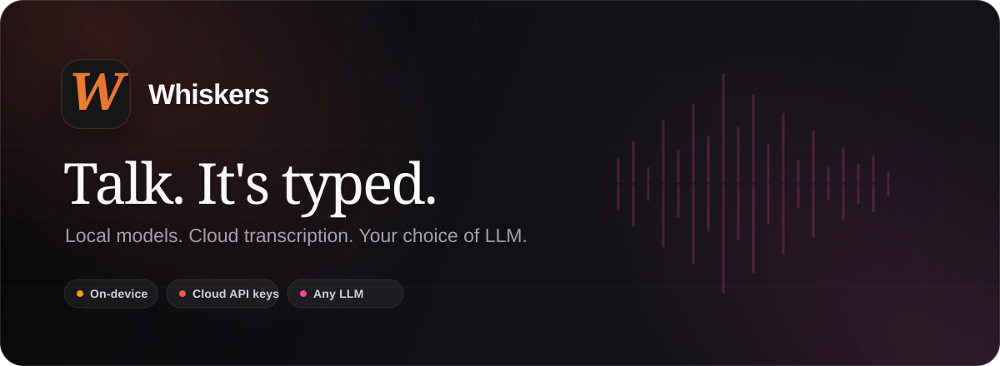

<!-- markdownlint-disable MD013 MD033 MD041 -->

  

  
  
  
  

  <strong>Native voice dictation that turns speech into text anywhere on your Mac.</strong> 
  Hold a shortcut, talk, and release. Whiskers transcribes your words and places them at your cursor.

  <a href="https://github.com/ceckenrode/whiskers-releases/releases/latest/download/Whiskers.dmg"><strong>Download for macOS</strong></a>
  ·
  <a href="https://whiskers.sh">Visit the website</a>
  ·
  <a href="https://whiskers.sh/docs">Read the docs</a>

> [!NOTE]
> This is the official public distribution repository for Whiskers. It contains production downloads and the Sparkle update feed; application development happens in a separate private source repository.

## What is Whiskers?

Whiskers is a native macOS menu bar app for people who can say an idea faster than they can type it. It works in the apps you already use—email, chat, documents, issue trackers, code editors, and anywhere else macOS gives you a text cursor.

The everyday workflow is intentionally small:

| 1. Hold | 2. Speak | 3. Release |
| :---: | :---: | :---: |
| Press your dictation shortcut from any app. | Talk naturally while the compact recording HUD follows along. | Whiskers transcribes and pastes the result where you were typing. |

Behind that simple interaction is a flexible transcription workspace. You can keep speech processing on your Mac, connect a cloud provider when you prefer one, optionally polish a transcript with AI, or bring longer recordings into Studio for review and export.

## The full product, not just the hotkey

### Dictate anywhere without changing how you work

Whiskers lives in the menu bar and stays out of the way until you need it. Use the default Function key or choose your own global shortcut, record with push-to-talk, or switch into lock mode for longer hands-free thoughts.

- **Paste into any app.** Dictate into Mail, Slack, Notes, a browser, an IDE, or any other Mac app with a text field.
- **Choose speed, language, and privacy.** Switch between lightweight local models, larger multilingual models, and optional cloud transcription.
- **Teach it your language.** Custom vocabulary improves names, brands, acronyms, libraries, and domain-specific terminology.
- **Turn phrases into complete text.** Snippets expand spoken triggers into addresses, signatures, templates, and other text you use repeatedly.
- **Never lose the useful part.** Search local transcript history and copy or reuse something you said earlier.

### Say it rough, send it polished

Optional AI enhancement turns natural, imperfect speech into text that is ready to send. Remove filler words, tighten rambling thoughts, change tone, format a list, translate, or run your own custom instruction automatically after transcription.

Whiskers can also:

- use **Screen Awareness** to recognize the names, code symbols, and terminology visible in your current work;
- rewrite **selected text in place** from a spoken instruction instead of starting a new dictation;
- preserve both the raw and enhanced versions in history;
- connect to OpenAI, Anthropic, Google, Groq, OpenRouter, Together, or a custom compatible endpoint using your own credentials.

Screen Awareness extracts relevant text, app, and window context. It never sends a screenshot image to the AI provider.

### Turn recordings into useful, searchable work

**Studio** brings the same transcription system to longer material: interviews, meetings, podcasts, screen recordings, voice notes, and video.

- Drop in MP3, WAV, M4A, FLAC, AAC, AIFF, MP4, or MOV files—including multiple files at once.
- Record an app's audio directly, with the option to include your microphone, then send it straight into the transcription queue.
- Choose a local or cloud model and a specific language, or let Whiskers detect the language for you.
- Review the result alongside waveform playback that follows the transcript.
- Add speaker labels with supported Deepgram models, rename people, and correct individual speaker turns.
- Chat with a transcript, use saved prompts, and apply an AI response as the enhanced version without overwriting the corrected original.
- Copy the result or export it as plain text and, when timestamp data is available, SRT subtitles.

Long recordings are segmented around natural speech breaks, transcribed in manageable chunks, and reassembled into one result. Saved Studio conversations are encrypted on disk and removed with their recording session.

## Model freedom without a forced cloud

Whiskers does not tie the product to one model vendor or one privacy tradeoff.

| Job | Current options |
| --- | --- |
| **Local transcription** | Parakeet V2, multilingual Parakeet V3, and WhisperKit models from tiny through large-v3-turbo |
| **Cloud transcription** | Groq, OpenAI, Deepgram, and Google Gemini |
| **AI enhancement** | OpenAI, Anthropic, Google, Groq, OpenRouter, Together, and custom providers |

| Mode | Where processing happens | Best for |
| --- | --- | --- |
| **Local transcription** | On your Mac with downloaded Core ML models | Privacy, offline use, and no per-minute API cost |
| **Cloud transcription** | Directly with the provider you configure | Provider-specific models or avoiding a local model download |
| **AI enhancement** | Transcript text is sent to the AI provider you choose | Cleanup, formatting, rewriting, and optional context-aware output |

Local transcription audio stays on your Mac. Network requests happen only when you choose a cloud transcription or AI feature. AI enhancement sends text—not your recorded audio—to the selected provider. API keys are stored in the macOS Keychain.

## What you are downloading

The recommended download is **`Whiskers.dmg`**, a standard drag-to-install macOS disk image containing the production `Whiskers.app`.

- **Native Mac app:** built with Swift, SwiftUI, AppKit, AVFoundation, and Core ML—not a browser wrapper.
- **Small initial download:** local speech models are selected and downloaded during setup rather than bundled into the app.
- **Production distribution:** release builds are Developer ID signed, notarized by Apple, and validated before publication.
- **Automatic updates:** Whiskers uses a signed Sparkle update feed and prompts when a new version is ready.
- **Alternate archive:** every release also includes `Whiskers.zip` for users who prefer a ZIP package.

### System requirements

- macOS 15 Sequoia or later
- Apple Silicon Mac (M1 or newer)
- Microphone and Accessibility permissions for global dictation and paste-back
- Screen Recording permission only if you enable optional screen-context features

## Install in a minute

1. [Download the latest `Whiskers.dmg`](https://github.com/ceckenrode/whiskers-releases/releases/latest/download/Whiskers.dmg).
2. Open the disk image and drag **Whiskers** into **Applications**.
3. Launch Whiskers and follow the guided setup.
4. Grant Microphone and Accessibility access, then choose a local model or configure a cloud provider.
5. Place your cursor in any app, hold your shortcut, speak, and release.

The `.dmg` is the best choice for most people. Use the [latest release page](https://github.com/ceckenrode/whiskers-releases/releases/latest) if you need the ZIP archive or want to inspect the release directly.

## Engineering at a glance

Whiskers is also an exploration of what a modern, deeply native AI utility can feel like on macOS:

- a Swift concurrency architecture built around actors and explicit recording states;
- multiple local and cloud engines behind one transcription service registry;
- Apple Neural Engine acceleration through Core ML runtimes;
- native menu bar, floating HUD, audio capture, permission, and paste integrations;
- secure Keychain-backed provider credentials and integrity-checked local model artifacts;
- signed and notarized DMG/ZIP releases with automated appcast generation and end-to-end update verification.

The product keeps the complicated parts—audio lifecycles, model routing, provider boundaries, cancellation, recovery, and release security—behind a workflow that still feels like **hold, speak, release**.

## Releases, updates, and support

| Resource | Destination |
| --- | --- |
| Latest download | [Download `Whiskers.dmg`](https://github.com/ceckenrode/whiskers-releases/releases/latest/download/Whiskers.dmg) |
| Release history | [Browse every release](https://github.com/ceckenrode/whiskers-releases/releases) |
| Product website | [whiskers.sh](https://whiskers.sh) |
| Documentation | [whiskers.sh/docs](https://whiskers.sh/docs) |
| Feedback and bugs | [Open an issue](https://github.com/ceckenrode/whiskers-releases/issues) |
| Product support | [whiskers.sh/support](https://whiskers.sh/support) |

  <em>Built for people who think faster than they type.</em>

